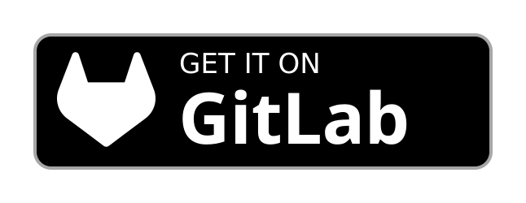

# MasterClock

> [!WARNING]
> This project is developed with the help of AI (Claude Code). Review the code accordingly before relying on it.

A chess clock app for chess, wargames, and tabletop games. Handles classic time controls as well as more complex multi-phase formats (Omni mode).

## Features

- Classic time controls: Sudden Death, Fischer, Bronstein, US Delay, Byoyomi (Japanese/Canadian/Progressive), Hourglass, Gong, Hidden/Random time, move counters, time banking.
- Omni mode: sequential game lists, custom round behavior, multi-phase turns (Think > Move > Resolve).
- Notebook, scoreboard, mini-games, game history with PGN/PDN/KIF export.
- QR code sharing and Bluetooth board support.
- Four build flavors (Complete, Standard, Light, Mini), plus a dedicated E-Ink version for Mudita devices with a minimal black-and-white UI.

## Flavors

| | Complete | Standard | Light | Mini | E-Ink |
|---|---|---|---|---|---|
| Modes settings | ✅ | ✅ | ✅ | ✅ (3 modes) | ✅ (3 modes) |
| Behavior / Display / Audio settings | ✅ | ✅ | ❌ | ❌ | ❌ |
| More (tools, backup, notebook…) | ✅ | ❌ | ❌ | ❌ | ❌ |
| Presets | ✅ | ✅ | ✅ | ❌ | ❌ |
| Arbitre mode | ✅ | ✅ | ✅ | ❌ | ❌ |

"3 modes" means Sudden Death, Fischer, and Move Timer Standard only — everything else supports the full set of timing modes.

## Credits & Licensing

- **Logo icon**: clock icon by [Paweł Kuna](https://opensvg.dev/icons) (v3.44.0), MIT License.
- **Chess pieces**: "Cburnett" style, from [Wikimedia Commons](https://commons.wikimedia.org/wiki/Category:SVG_chess_pieces), by [Cburnett](https://en.wikipedia.org/wiki/User:Cburnett/GFDL_images/Chess). GFDL and CC BY-SA 3.0.
- **Audio**:
  - Gong: [Zen Gong – Alex_Jauk](https://pixabay.com/sound-effects/film-special-effects-zen-gong-199844/)
  - Beep: [Beep – u_edtmwfwu7c](https://pixabay.com/sound-effects/film-special-effects-beep-329314/)
  - Final beep: [Public Domain Beep Sound – qubodup](https://pixabay.com/sound-effects/public-domain-beep-sound-100267/)
  - Switch: [Light Switch – Pixabay](https://pixabay.com/sound-effects/film-special-effects-light-switch-82388/)

Project licensed under the MIT License.
